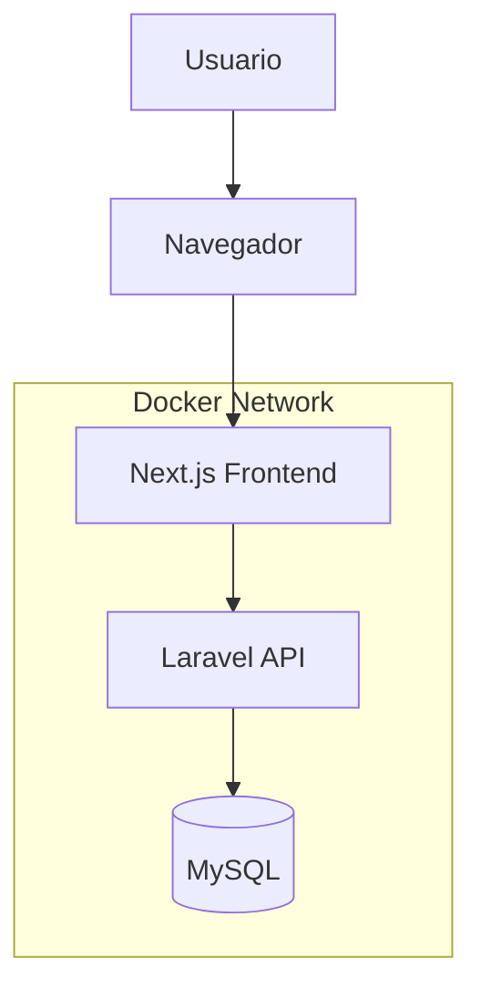
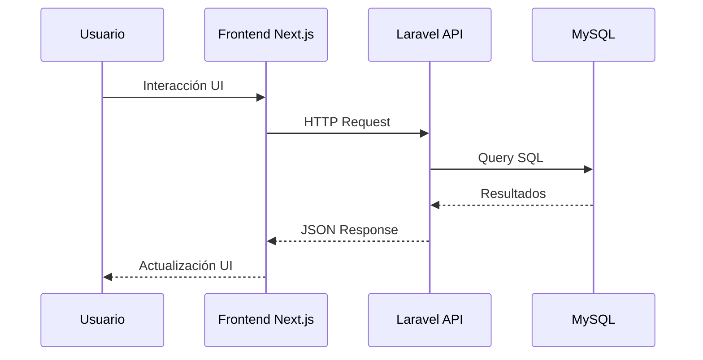

# VERTISOL Front-End

Frontend oficial del sistema VERTISOL desarrollado con Next.js, React y TypeScript.

---

# Descripción General

VERTISOL es una aplicación web moderna orientada a la gestión empresarial, desarrollada bajo una arquitectura desacoplada utilizando:

- Frontend SPA/SSR con Next.js
- Backend API REST con Laravel
- Base de datos MySQL
- Docker para contenerización

El frontend consume servicios REST expuestos por la API Laravel.

---

# Tecnologías Utilizadas

| Tecnología | Descripción |
|---|---|
| Next.js | Framework React para SSR/SPA |
| React | Librería UI |
| TypeScript | Tipado estático |
| TailwindCSS | Framework CSS |
| Axios | Cliente HTTP |
| Docker | Contenerización |
| Docker Compose | Orquestación |
| Laravel API | Backend del sistema |

---

# Arquitectura Frontend



---

# Características Principales

- Arquitectura desacoplada Frontend/Backend
- Componentes reutilizables
- TypeScript tipado
- Manejo global de estado
- Integración con APIs REST
- Docker Ready
- Responsive Design
- Estructura escalable
- Hot Reload
- Modularización de vistas

---

# Estructura del Proyecto

```text
VERTISOL-front-end/
│
├── public/
│
├── src/
│   ├── app/
│   ├── components/
│   ├── context/
│   ├── hooks/
│   ├── services/
│   ├── lib/
│   ├── types/
│   ├── utils/
│   └── styles/
│
├── Dockerfile
├── package.json
├── tsconfig.json
└── next.config.js
```

---

# Requisitos Previos

Antes de ejecutar el proyecto necesitas:

- Node.js >= 18
- Docker
- Docker Compose
- Git

---

# Instalación Local

## 1. Clonar repositorio

```bash
git clone https://github.com/IngLucioChavez/VERTISOL-front-end.git
```

## 2. Entrar al proyecto

```bash
cd VERTISOL-front-end
```

## 3. Instalar dependencias

```bash
npm install
```

## 4. Ejecutar proyecto

```bash
npm run dev
```

---

# Ejecución con Docker

## Levantar contenedores

```bash
docker compose up -d
```

## Detener contenedores

```bash
docker compose down
```

---

# Variables de Entorno

Crear archivo `.env.local`

```env
NEXT_PUBLIC_API_URL=http://localhost:8000/api
```

---

# Scripts Disponibles

| Script | Descripción |
|---|---|
| npm run dev | Ejecuta entorno desarrollo |
| npm run build | Genera build producción |
| npm run start | Inicia producción |
| npm run lint | Ejecuta linting |

---

# Comunicación con Backend

El frontend consume endpoints REST expuestos por Laravel.

## Ejemplo de flujo

```text
Frontend Next.js
      │
      ▼
Axios HTTP Client
      │
      ▼
Laravel API
      │
      ▼
MySQL
```

---

# Docker Compose

El frontend está integrado dentro de una arquitectura multi-contenedor.

## Servicios relacionados

- Frontend Next.js
- Backend Laravel
- MySQL
- phpMyAdmin

---

# Configuración Docker Frontend

```yaml
frontend:
  container_name: NEXT-TS-VERTISOL
  build:
    context: ./front-end
    dockerfile: Dockerfile
  ports:
    - "5180:3000"
  volumes:
    - ./front-end:/var/www/app
    - /var/www/app/node_modules
    - /app/.next
```

---

# Flujo General de la Aplicación



---

# Buenas Prácticas Implementadas

- Componentización
- Separación de responsabilidades
- Manejo centralizado de peticiones HTTP
- Uso de TypeScript
- Arquitectura escalable
- Dockerización completa
- Configuración desacoplada mediante variables de entorno

---

# Puertos Utilizados

| Servicio | Puerto |
|---|---|
| Frontend Next.js | 5180 |
| Backend Laravel | 8000 |
| MySQL | 3306 |
| phpMyAdmin | 8080 |

---

# Deploy

## Build producción

```bash
npm run build
```

## Ejecutar producción

```bash
npm run start
```

---

# Repositorio Oficial

Repositorio GitHub:

https://github.com/IngLucioChavez/VERTISOL-front-end

---

# Autor

Desarrollado por:

**Lucio Francisco Chávez García**

---

# Licencia

Proyecto privado — VERTISOL.